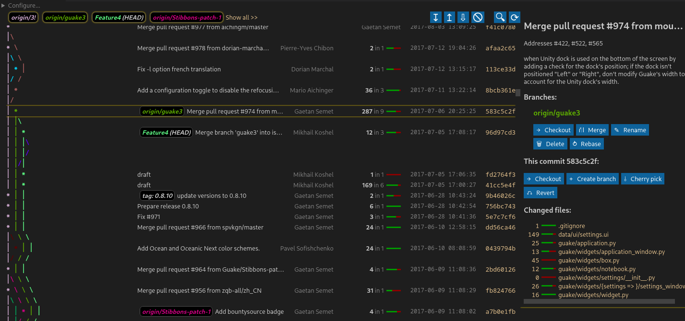

# git log --graph: VSCode extension

Customizable Git explorer. Linux/Mac only currently.

You can **install the extension in VSCode from [HERE](https://marketplace.visualstudio.com/items?itemName=phil294.git-log--graph)** or for VSCodium from [Open VSX Registry](https://open-vsx.org/extension/phil294/git-log--graph).

This is a [free](https://en.wikipedia.org/wiki/Free_and_open-source_software#Four_essential_freedoms_of_Free_Software) and feature-oriented alternative to [Git Graph by mhutchie](https://github.com/mhutchie/vscode-git-graph/). More details at the bottom of this Readme.



## Actions

In this example, when you click on the `Merge` button, this window opens:


This allows you to set params and modify the command before executing, both via option toggling and direct editing. To keep the state saved for next time, you can click `Save`.

All Git actions (blue buttons) work like that. Even the main `git log` action itself is a modifiable field: By default it holds

    log --graph --oneline --pretty=VSCode --author-date-order -n 15000 --skip=0 --all $(git reflog show --format='%h' stash)

You shouldn't edit the `--pretty` argument of course, but if you for example want to view the log of a subfolder, all you need to do is add ` -- subfolder` to the end of the command.

Please *be careful editing any of the input fields or config*, as they are all passed to your command line AS IS, that is, without escaping. For example, if you change the above merge command to `merge '$1' --no-commi` (typo, `t` missing at the end), this will still be executed and result in a Git error. If you change it to `status; reboot`, your computer will attempt to shut down, so probably don't do that.

`$()` and `;` in the examples above are shell features. Also, this extension expects `git` to be a globally available command. Because of that, Windows is not supported. It would of course be doable, but I don't have a Win system at hand and simply cannot be bothered. If you want Windows support, you can send in a PR, check [CONTRIBUTING.md](./CONTRIBUTING.md).

## Features

Notable features:
 - Default actions: fetch, stash, pop, fetch, merge/abort, cherry-pick/abort, checkout, create, revert, apply, rename, delete, rebase. *Extendable with more commands, see *Customization* below*.
 - Sticky header
 - List of branches at the top; click on any branch to jump to its tip. It always shows all known branches visible in the current viewport. This means that the list of branches updates when you scroll, but you can also display all at once.
 - Quick jump search and filtering 🔍 (also via Ctrl+f)
 - Changed files can be clicked and open up diff view in new tab
 - By default, 15,000 commits are loaded and displayed at once (see log cmd) and rendered efficiently inside a virtual scroller. Because of this, you can quickly scroll over thousands of commits without slowing down or performance issues.
 - Show stashes
 - Green/red insertions/deletion stats
 - Drag/drop branch tips on top of each other to merge etc.

## Configuration

You can set `"git-log--graph.folder"` to some desired *absolute* path in which a .git folder is located. Multi-root workspaces (multiple or nested folders) are currently not supported. If this option is not specified, the root of the first available workspace folder is used.

### Customization

All blue buttons are completely customizable; you can edit and add as many actions as you like. You don't *have* to customize it though, the defaults should be fine for most use cases.

Let's say you wanted to add a `git switch` action button, with convenience checkboxes for `--detach` and / or `--force`.
There are five kinds of actions: `global` (top icons), `commit` (right box), `branch` (right box if any branch present), `stash` (right box if stash present) and `branch-drop` (for when you've dragged one branch tip on top of another).
`switch` works with branches, so it should be a `branch` action.

The only required parameters per action are `title` and `args`.

```jsonc
// VSCode settings.json
"git-log--graph.actions.branch": [
    // ... the default actions, VSCode should put them here automatically so you can also edit them.
    {
        "title": "⇆   Switch", // Whatever you want to appear on the button itself. Title is also used as a cache key (see `Save` above).
        "args": "switch '$1'", // The actual command, appended to `git `. This will be executed WITHOUT VALIDATION SO BE CAREFUL. $1, $2 and so on are placeholders for the respective `params`.
        "params": [ "{BRANCH_NAME}" ], // Default values for the `args` placeholders. You can write anything here, including special keywords that include: `{BRANCH_NAME}`, `{COMMIT_HASH}`, {SOURCE_BRANCH_NAME} and {TARGET_BRANCH_NAME} (where it makes sense).
        // `options` are just an easy and quick way to toggle common trailing options. You can also specify them manually in `args` of course, given that `args` is also editable yet again at runtime.
        "options": [
            { "value": "--detach", "default_active": false },
            { "value": "--force", "default_active": false },
        ],
        "description": "Some button tooltip text",
        "immediate": false, // if true, the command executes without another user interaction step and closes again, except on error.
        "ignore_errors": false // can rarely be useful in combination with `immediate`
    }
]
```
This is what you'll get:


## Changelog

Entries usually sorted by importance.

### 0.0.3 2022-09-17
- [`8f9dfd4`](https://github.com/phil294/git-log--graph/commit/8f9dfd4) Add drag/drop for branches. These actions are also configurable. By default there's `merge` and `rebase`.
- [`90531ce`](https://github.com/phil294/git-log--graph/commit/90531ce) Highlight the HEAD branch all the time
- [`59b478d`](https://github.com/phil294/git-log--graph/commit/59b478d) When scrolling to branch tip, also select the respective commit
- [`8434cc4`](https://github.com/phil294/git-log--graph/commit/8434cc4) In stash commits, show untracked change files too
- [`836debd`](https://github.com/phil294/git-log--graph/commit/836debd) Add `git reset --merge` to the abort default action
- [`8c55bc2`](https://github.com/phil294/git-log--graph/commit/8c55bc2) Enforce/overwrite dark theme on everything. Native dark/light theme support would be better, but the easiest way forward to fix any remaining color issues.
- [`32e211a`](https://github.com/phil294/git-log--graph/commit/32e211a) Make git conflict message detection locale independent (hopefully)
- [`667fa11`](https://github.com/phil294/git-log--graph/commit/667fa11) Make the " (HEAD)" part clickable
- [`c861a8b`](https://github.com/phil294/git-log--graph/commit/c861a8b) Add a thin line below the nav bar in main view
- [`25a54bf`](https://github.com/phil294/git-log--graph/commit/25a54bf) Action configuration: Apply replacements to title and description also

### 0.0.2 2022-06-05
- [`ac6ceee`](https://github.com/phil294/git-log--graph/commit/ac6ceee) Set icon

### 0.0.1 2022-06-05

## Relation to [mhutchie.git-graph](https://github.com/mhutchie/vscode-git-graph/)

Michael Hutchison's extension is awesome - if you haven't yet, I highly recommend checking it out. It has more features, is much more stable and a generally well thought-out and documented Open Source project.

But there are drawbacks:
 1. [It does not allow redistribution or publishing derivative works.](https://github.com/mhutchie/vscode-git-graph/blob/develop/LICENSE). This means that for every feature request, we need to wait for mhutchie to merge it himself and no forks can be published on the marketplace.
 2. It's a rather complex piece of software for its purpose (~20,000 lines of TS code (LOC) plus another 20,000 for tests) and modifications of any kind almost always require substantial effort.
 3. There are [49 open issues](https://github.com/mhutchie/vscode-git-graph/labels/feature%20request) tagged as feature request
 4. Important features such as sticky header or customizable `git log` arguments are missing
 5. There has been [almost no activity](https://github.com/mhutchie/vscode-git-graph/commits/develop) for over a year now. Under normal circumstances, this is of course totally fine. However, in a project that *by License* depends on a sole maintainer and disallows forks, this is - in my opinion - at least problematic, given its popularity.

This very extension, `phil294/git-log--graph`, on the other hand:
 1. Is MIT-licensed which is a [free (FOSS)](https://en.wikipedia.org/wiki/Free_and_open-source_software#Four_essential_freedoms_of_Free_Software) license
 2. Takes a very minimalist approach in its codebase: I wrote a mere 1,300 lines in total for it (no fork). Now obviously, LOC is a stupid measurement for almost anything, but it does say something about the complexity nonetheless. For example, implementing querying git for commit body and showing it in details view was a change consisting of [six LOC](https://github.com/phil294/git-log--graph/commit/4fb4cf2d08fac833f57758119995d994fee349db)
 3. All relevant logic is customizable by design

I hope I'm not coming across like an ass here; again, mhutchie/vscode-git-graph is really good, but I think it sets its priorities wrong, especially in the fast-paced ecosystem that is Javascript development.

## Contributing

Please open issues for feature requests, many can likely be quickly implemented. If you want to code for yourself, have a look into [CONTRIBUTING.md](./CONTRIBUTING.md) where the architecture is explained in more detail.