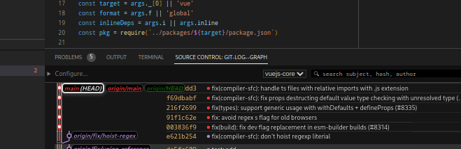
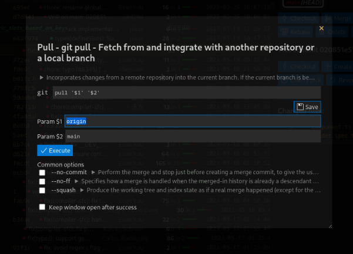

# git log --graph: VSCode extension

Customizable Git explorer.

This is a [free](https://en.wikipedia.org/wiki/Free_and_open-source_software#Four_essential_freedoms_of_Free_Software), feature-oriented and maintained alternative to [Git Graph by mhutchie](https://github.com/mhutchie/vscode-git-graph/). More details at the bottom of this Readme.


Also available as a "view" with option `"git-log--graph.position": "view"`



## Usage

You can **install the extension in VSCode from [HERE](https://marketplace.visualstudio.com/items?itemName=phil294.git-log--graph)** or for VSCodium from [Open VSX Registry](https://open-vsx.org/extension/phil294/git-log--graph).

Then run the command: `git log --graph: Open graph view` or just click the `Git Log` action menu in the bottom status bar. That's all you need to know really, everything below is subordinate.

## Actions

When you click on the `Merge` button for example, a window like this opens:



This allows you to set params and modify the command before executing, both via option toggling and direct editing. To keep the state saved for next time, you can click `Save`.

All Git actions (blue buttons) work like that. Even the main `git log` action itself is a modifiable field: By default it holds

    log --graph --oneline --date=iso-local --pretty={EXT_FORMAT} -n 15000 --skip=0 --all {STASH_REFS} --color=never --invert-grep --extended-regexp --grep=\"^untracked files on \" --grep=\"^index on \"" --author-date-order

You shouldn't edit the `--pretty` argument of course, but if you for example want to view the log of a subfolder or for a specific file, all you need to do is add ` -- subfolder` to the end of the command. If you want to get rid of the entire branch visualization, remove the `--graph` part.

Please *be careful editing any of the input fields or config*, as they are all passed to your command line AS IS, that is, without escaping. For example, if you change the above merge command to `merge '$1' --no-commi` (typo, `t` missing at the end), this will still be executed and result in a Git error. If you change it to `status; reboot`, your computer will attempt to shut down, so probably don't do that.

All OS Linux/Mac/Windows are supported.

## Features

Notable features:
 - Default actions: fetch, stash, pop, fetch, merge/abort, cherry-pick/abort, checkout, create, revert, apply, rename, delete, rebase. *Extendable with more commands, see *Customization* below*.
 - Sticky header
 - List of branches at the top; click on any branch to jump to its tip. It always shows all known branches visible in the current viewport. This means that the list of branches updates when you scroll, but you can also display all at once.
 - Drag/drop branch tips on top of each other to merge etc.
 - Right click context menus
 - Quick jump search and filtering 🔍 (also via Ctrl+f)
 - Changed files can be clicked and open up diff view in new tab
 - By default, 15,000 commits are loaded and displayed at once (see log cmd) and rendered efficiently inside a virtual scroller. Because of this, you can quickly scroll over thousands of commits without slowing down or performance issues.
 - Show stashes
 - Green/red insertions/deletion stats
 - History of your last clicks, searches and actions
 - `git help ...` texts collapsed baked into the default actions
 - Select multiple commits with Ctrl or Shift to compare or apply bulk actions (cherry-pick, revert)
 - Custom CSS
 - Blame: Shows last commit for current line in status bar to focus and open in main view
 - File history
 - Branch history

## Configuration

### Buttons

All blue buttons are completely customizable; you can add as many actions as you like. You don't *have* to customize it though, the defaults should be fine for most use cases.

Let's say you wanted to add a `git switch` action button, with convenience checkboxes for `--detach` and / or `--force`.
There are five kinds of actions:
 1. `global`: top icons
 1. `commit`: right box or context menu of single commit
 1. `commits`: right box for multiple selected commits
 1. `branch`: right box if branch present or context menu
 1. `stash` right box if stash present or context menu
 1. `tag` right box if tag present or context menu
 1. `branch-drop` for when you've dragged one branch tip on top of another

`switch` works with branches, so it should be a `branch` action.

The only required parameters per action are `title` and `args`.

```jsonc
// VSCode settings.json
"git-log--graph.actions.branch": [
    // You'll be extending the default actions here with your custom additions:
    {
        "title": "Switch", // Whatever you want to appear on the button itself. Title is also used as a cache key (see `Save` above).
        "icon": "arrow-swap", // An icon to display next to the title. Choose one from https://microsoft.github.io/vscode-codicons/dist/codicon.html
        "description": "git switch - Switch branches", // An extended title that will be shown as tooltip on button mouse hover and as a subtitle in the action popup. For the defaults, this is the first NAME line of `git help [the-command]`.
        // More detailed help to understand what this command is about: Will help more inexperienced users. Will be collapsed by default, so this may be verbose. For the defaults, this is largely the DESCRIPTION section of `git help [the-command]`:
        "info": "Switch to a specified branch. The working tree and the index are updated to match the branch. All new commits will be added to the tip of this branch.\n\nOptionally a new branch could be created with either -c, -C, automatically from a remote branch of bla bla etc",
        "args": "switch \"$1\"", // The actual command, appended to `git `. This will be executed WITHOUT VALIDATION SO BE CAREFUL. $1, $2 and so on are placeholders for the respective `params`.
        "params": [ "{LOCAL_BRANCH_NAME}" ], // Default values for the `args` placeholders. You can write anything here, including special keywords that include: {BRANCH_NAME}, {LOCAL_BRANCH_NAME}, {REMOTE_NAME}, {COMMIT_HASH}, {COMMIT_HASHES}, {STASH_NAME}, {TAG_NAME}, {SOURCE_BRANCH_NAME} and {TARGET_BRANCH_NAME} (where it makes sense).
        // `options` are just an easy and quick way to toggle common trailing options. You can also specify them manually in `args` of course, given that `args` is also editable yet again at runtime.
        "options": [
            {
            	"value": "--detach", // what is to be appended to the input field if toggled
            	"default_active": false,
            	// More detailed help to understand what this option is about. Will be collapsed by default, so this may be verbose. For the defaults, this is largely the --option description text of `git help [the-command]`:
            	"info": "For inspection and discardable experiments"
            },
            { "value": "--force", "default_active": false },
        ],
        "immediate": false, // if true, the command executes without another user interaction step and closes again, except on error.
        "ignore_errors": false // can rarely be useful in combination with `immediate`
    }
]
```
This is what you'll get:


Please consider opening an issue or PR if you think a certain action or option warrants a place in the defaults.

### Other config options

```jsonc
// VSCode settings.json
{
    "git-log--graph.position": {
        "description": "Decide how/where the extension should appear. Changing this option REQUIRES RELOAD.",
        "type": "string",
        "default": "editor",
        "enum": [
            "editor",
            "view"
        ],
        "enumDescriptions": [
            "As a regular editor tab, so it will be treated like one of your open files",
            "As a view in the Source Control side nav section. You will also be able to drag it to any other place in the interface."
        ]
    },
    "git-log--graph.hide-quick-branch-tips": {
        "description": "If active, the area at the top with the dotted branch lines and git status will not be shown anymore.",
        "type": "boolean",
        "default": false
    },
    "git-log--graph.show-inferred-quick-branch-tips": {
        "description": "(Depends on 'hide-quick-branch-tips' to be false) If active, the area at the top with the dotted branch lines will also include inferred branch lines, meaning branches that have been deleted or are unavailable but whose name could be reconstructed based on merge commit message.",
        "type": "boolean",
        "default": false
    },
    "git-log--graph.disable-scroll-snapping": {
        "description": "If active, the mouse wheel event on the scroller will not be caught and instead behave normally. This comes at the expense of the dotted connection lines at the top being offset wrongly more often.",
        "type": "boolean",
        "default": false
    },
    "git-log--graph.branch-width": {
        "description": "The width of the individual branch lines, including both line and right spacing. The default 'auto' chooses between 10 and 2 depending on the size of the repository.",
        "type": [
            "integer",
            "string"
        ],
        "default": "auto"
    },
    "git-log--graph.hide-sidebar-buttons": {
        "description": "If active, the buttons for commit, branches, stashes and tags will not be shown anymore in the side bar for a selected commit. The actions are then only available via context menu (right click) in the main view itself.",
        "type": "boolean",
        "default": false
    },
    "git-log--graph.folder": {
        "description": "Use this to overwrite the desired *absolute* path in which a .git folder is located. You usually don't need to do this as folder selection is available from the interface.",
        "type": "string"
    },
    "git-log--graph.verbose-logging": {
        "type": "boolean",
        "default": false
    },
    "git-log--graph.curve-radius": {
        "description": "How curvy the branch visualization should look. Set to 0 to disable curviness. Otherwise, it's recommended to set between 0.3 and 0.6 or things look weird.",
        "type": "number",
        "minimum": 0,
        "maximum": 1,
        "default": 0.4
    },
    "git-log--graph.custom-css": {
		"description": "An abitrary string of CSS that will be injected into the main web view. Example: * { text-transform: uppercase; }",
		"type": "string",
		"default": "",
	},
}
```

## Relation to [mhutchie.git-graph](https://github.com/mhutchie/vscode-git-graph/)

Michael Hutchison's extension is awesome - if you haven't yet, I highly recommend checking it out. It has more features, is much more stable and a generally well thought-out and documented Open Source project.

But there are drawbacks:
 1. [It does not allow redistribution or publishing derivative works.](https://github.com/mhutchie/vscode-git-graph/blob/develop/LICENSE). This means that for every feature request, we need to wait for mhutchie to merge it himself and no forks can be published on the marketplace.
 1. It's a rather complex piece of software for its purpose (~20,000 lines of TS code (LOC) plus another 20,000 for tests) and modifications of any kind almost always require substantial effort.
 1. There are [49 open issues](https://github.com/mhutchie/vscode-git-graph/labels/feature%20request) tagged as feature request
 1. Important features such as sticky header or customizable `git log` arguments are missing
 1. There has been [almost no activity](https://github.com/mhutchie/vscode-git-graph/commits/develop) for over a year now. Under normal circumstances, this is of course totally fine. However, in a project that *by License* depends on a sole maintainer and disallows forks, this is - in my opinion - at least problematic, given its popularity.

This very extension, `phil294/git-log--graph`, on the other hand:
 1. Is MIT-licensed which is a [free (FOSS)](https://en.wikipedia.org/wiki/Free_and_open-source_software#Four_essential_freedoms_of_Free_Software) license
 1. Takes a very minimalist approach in its codebase: I wrote a mere 1,300 lines in total for it (no fork). Now obviously, LOC is a stupid measurement for almost anything, but it does say something about the complexity nonetheless. For example, implementing querying git for commit body and showing it in details view was a change consisting of [six LOC](https://github.com/phil294/git-log--graph/commit/4fb4cf2d08fac833f57758119995d994fee349db)
 1. All relevant logic is customizable by design
 1. Is built with the help of a web framework (Vue.js)


I hope I'm not coming across like an ass here; again, mhutchie/vscode-git-graph is really good, but I think it sets its priorities wrong, especially in the fast-paced ecosystem that is Javascript development.

## Contributing

Please open issues for feature requests, many can likely be quickly implemented. If you want to code for yourself, have a look into [CONTRIBUTING.md](./CONTRIBUTING.md) where the architecture is explained in more detail.
