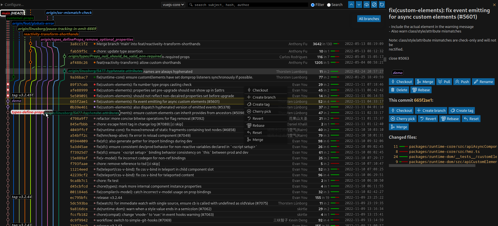
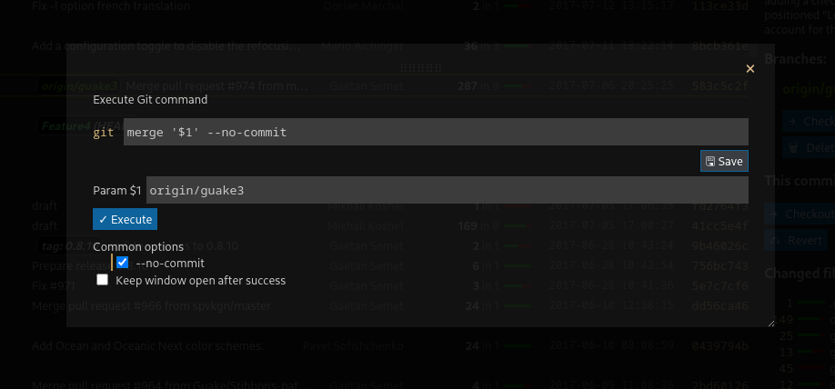
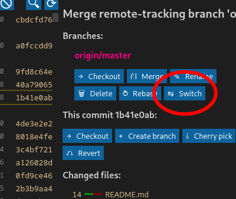
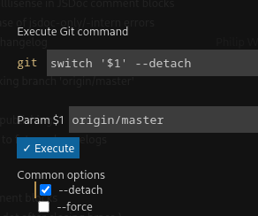

# git log --graph: VSCode extension

Customizable Git explorer.

This is a [free](https://en.wikipedia.org/wiki/Free_and_open-source_software#Four_essential_freedoms_of_Free_Software), feature-oriented and maintained alternative to [Git Graph by mhutchie](https://github.com/mhutchie/vscode-git-graph/). More details at the bottom of this Readme.



Also available as a "view" with option `"git-log--graph.position": "view"`


## Usage

You can **install the extension in VSCode from [HERE](https://marketplace.visualstudio.com/items?itemName=phil294.git-log--graph)** or for VSCodium from [Open VSX Registry](https://open-vsx.org/extension/phil294/git-log--graph).

Then run the command: `git log --graph: Open graph view` or just click the `Git Log` action menu in the bottom status bar. That's all you need to know really, everything below is subordinate.

## Actions

When you click on the `Merge` button for example, a window like this opens:



This allows you to set params and modify the command before executing, both via option toggling and direct editing. To keep the state saved for next time, you can click `Save`.

All Git actions (blue buttons) work like that. Even the main `git log` action itself is a modifiable field: By default it holds

    log --graph --oneline --pretty={EXT_FORMAT} -n 15000 --skip=0 --all {STASH_REFS} --invert-grep --grep=\"^untracked files on \" --grep=\"^index on \""

You shouldn't edit the `--pretty` argument of course, but if you for example want to view the log of a subfolder or for a specific file, all you need to do is add ` -- subfolder` to the end of the command.

Please *be careful editing any of the input fields or config*, as they are all passed to your command line AS IS, that is, without escaping. For example, if you change the above merge command to `merge '$1' --no-commi` (typo, `t` missing at the end), this will still be executed and result in a Git error. If you change it to `status; reboot`, your computer will attempt to shut down, so probably don't do that.

All OS Linux/Mac/Windows are supported.

## Features

Notable features:
 - Default actions: fetch, stash, pop, fetch, merge/abort, cherry-pick/abort, checkout, create, revert, apply, rename, delete, rebase. *Extendable with more commands, see *Customization* below*.
 - Sticky header
 - List of branches at the top; click on any branch to jump to its tip. It always shows all known branches visible in the current viewport. This means that the list of branches updates when you scroll, but you can also display all at once.
 - Drag/drop branch tips on top of each other to merge etc.
 - Right click context menus
 - Quick jump search and filtering 🔍 (also via Ctrl+f)
 - Changed files can be clicked and open up diff view in new tab
 - By default, 15,000 commits are loaded and displayed at once (see log cmd) and rendered efficiently inside a virtual scroller. Because of this, you can quickly scroll over thousands of commits without slowing down or performance issues.
 - Show stashes
 - Green/red insertions/deletion stats
 - Select multiple commits with Ctrl or Shift to compare or apply bulk actions (cherry-pick, revert)

## Configuration

### Buttons

All blue buttons are completely customizable; you can add as many actions as you like. You don't *have* to customize it though, the defaults should be fine for most use cases.

Let's say you wanted to add a `git switch` action button, with convenience checkboxes for `--detach` and / or `--force`.
There are five kinds of actions:
 1. `global`: top icons
 1. `commit`: right box or context menu of single commit
 1. `commits`: right box for multiple selected commits
 1. `branch`: right box if branch present or context menu
 1. `stash` right box if stash present or context menu
 1. `tag` right box if tag present or context menu
 1. `branch-drop` for when you've dragged one branch tip on top of another

`switch` works with branches, so it should be a `branch` action.

The only required parameters per action are `title` and `args`.

```jsonc
// VSCode settings.json
"git-log--graph.actions.branch": [
    // You'll be extending the default actions here with your custom additions:
    {
        "title": "Switch", // Whatever you want to appear on the button itself. Title is also used as a cache key (see `Save` above).
        "icon": "arrow-swap", // An icon to display next to the title. Choose one from https://microsoft.github.io/vscode-codicons/dist/codicon.html
        "args": "switch '$1'", // The actual command, appended to `git `. This will be executed WITHOUT VALIDATION SO BE CAREFUL. $1, $2 and so on are placeholders for the respective `params`.
        "params": [ "{LOCAL_BRANCH_NAME}" ], // Default values for the `args` placeholders. You can write anything here, including special keywords that include: {BRANCH_NAME}, {LOCAL_BRANCH_NAME}, {REMOTE_NAME}, {COMMIT_HASH}, {COMMIT_HASHES}, {STASH_NAME}, {TAG_NAME}, {SOURCE_BRANCH_NAME} and {TARGET_BRANCH_NAME} (where it makes sense).
        // `options` are just an easy and quick way to toggle common trailing options. You can also specify them manually in `args` of course, given that `args` is also editable yet again at runtime.
        "options": [
            { "value": "--detach", "default_active": false },
            { "value": "--force", "default_active": false },
        ],
        "description": "Some button tooltip text",
        "immediate": false, // if true, the command executes without another user interaction step and closes again, except on error.
        "ignore_errors": false // can rarely be useful in combination with `immediate`
    }
]
```
This is what you'll get:





Please consider opening an issue or PR if you think a certain action or option warrants a place in the defaults.

### Other config options

```jsonc
// VSCode settings.json
{
    "git-log--graph.position": {
        "description": "Decide how/where the extension should appear. Changing this option REQUIRES RELOAD.",
        "type": "string",
        "default": "editor",
        "enum": [
            "editor",
            "view"
        ],
        "enumDescriptions": [
            "As a regular editor tab, so it will be treated like one of your open files",
            "As a view in the Source Control side nav section. You will also be able to drag it to any other place in the interface."
        ]
    },
    "git-log--graph.hide-quick-branch-tips": {
        "description": "If active, the area at the top with the dotted branch lines and git status will not be shown anymore.",
        "type": "boolean",
        "default": false
    },
    "git-log--graph.disable-scroll-snapping": {
        "description": "If active, the mouse wheel event on the scroller will not be caught and instead behave normally. This comes at the expense of the dotted connection lines at the top being offset wrongly more often.",
        "type": "boolean",
        "default": false
    },
    "git-log--graph.branch-width": {
        "description": "The width of the individual branch lines, including both line and right spacing. The default 'auto' chooses between 10 and 2 depending on the size of the repository.",
        "type": [
            "integer",
            "string"
        ],
        "default": "auto"
    },
    "git-log--graph.folder": {
        "description": "Use this to overwrite the desired *absolute* path in which a .git folder is located. You usually don't need to do this as folder selection is available from the interface.",
        "type": "string"
    },
    "git-log--graph.verbose-logging": {
        "type": "boolean",
        "default": false
    }
}
```

## Changelog

Entries usually sorted by importance.

### 0.1.3 2023-05-14
- [`2912c4a`](https://github.com/phil294/git-log--graph/commit/2912c4a) Keep extension open on vscode restart - so just like any other "editor" (tab), it will keep its position, pin status etc. Not the scroll position within the view though, as it doesn't seem like a good idea (?)
- [`0ab1161`](https://github.com/phil294/git-log--graph/commit/0ab1161) Fix merging a remote branch: Falsely tried to merge the local counterpart instead
- [`d030697`](https://github.com/phil294/git-log--graph/commit/d030697) Improve scroll snapping so it's less annoying (#7)
- [`1d020d5`](https://github.com/phil294/git-log--graph/commit/1d020d5) Make scroll snapping optional with new option `git-log--graph.disable-scroll-snapping` (#7)
- [`a7167ed`](https://github.com/phil294/git-log--graph/commit/a7167ed) Refresh main view on external changes, most notably when doing commits
- [`9d09389`](https://github.com/phil294/git-log--graph/commit/9d09389) Force single instance: Switches to previously opened instance when attempting to open twice
- [`a91d226`](https://github.com/phil294/git-log--graph/commit/a91d226) Make selected commit side bar's hash selectable again
- [`199da81`](https://github.com/phil294/git-log--graph/commit/199da81) Start up slightly later to not slow initial vscode startup down
- [`7d8214b`](https://github.com/phil294/git-log--graph/commit/7d8214b) Fix extension crash when folder loading took too long, and increase timeout for it from 200 to 2000ms
- [`da969db`](https://github.com/phil294/git-log--graph/commit/da969db) Folder detection fallback for when initial folder scan took too long (>2s)
- [`09211a0`](https://github.com/phil294/git-log--graph/commit/09211a0) Fix error message prompt on git log error


### 0.1.2 2023-05-11
- [`3024d97`](https://github.com/phil294/git-log--graph/commit/3024d97) Add status bar shortcut (#5), so now you can also click on the `Git Log` menu instead of running the command.
- [`bbbaa8f`](https://github.com/phil294/git-log--graph/commit/bbbaa8f) Fix diff view (was the wrong way left/right)
- [`a60712e`](https://github.com/phil294/git-log--graph/commit/a60712e) Fix checkout of remote branches. Now just checks out the local branch name instead which in modern Git actually creates a new local tracking branch beforehand named after the remote one if it didn't exist. In other words, checkout `origin/main` now does a checkout `main`.
- [`ed873f4`](https://github.com/phil294/git-log--graph/commit/ed873f4) Fix branch logic (coloring, searching etc) for when more than one branch is connected to a single commit
- [`73d086d`](https://github.com/phil294/git-log--graph/commit/73d086d) Fix closing the Selected Commit view by pressing the X button
- [`12d73e0`](https://github.com/phil294/git-log--graph/commit/12d73e0) Show loading animation while immediate actions load. So for example when you click "Fetch", you'll now see that something is happening when your network is slow and it's not possible to click it again while doing so.
- [`9ad180b`](https://github.com/phil294/git-log--graph/commit/9ad180b) Move ref tags like branch tips a bit closer to their respective commit circle
- [`883edd0`](https://github.com/phil294/git-log--graph/commit/883edd0) Bundle extension js with esbuild. This reduces final bundle size by about 80% (as it was in prior updates) as node_modules aren't shipped anymore

### 0.1.1 2023-05-02
- Fix extension startup

### 0.1.0 2023-05-02
- [`bff9e5c`](https://github.com/phil294/git-log--graph/commit/bff9e5c) Windows support added thanks to @iamfraggle [#4](https://github.com/phil294/git-log--graph/pull/4) 🎉 (this was part of 0.0.5 already but not in changelog before)
- [`6a9b422`](https://github.com/phil294/git-log--graph/commit/6a9b422) New SVG-based graph visualization and large interface and style overhaul. Tell me if you miss the previous one, we can make stuff configurable if necessary. Sorry for breaking your work flow, but this should be the last major UI/UX update forever.
- [`0a66679`](https://github.com/phil294/git-log--graph/commit/0a66679) Make branch and commit actions available via context menu too (right click)
- [`cda96c2`](https://github.com/phil294/git-log--graph/commit/cda96c2) Add folder selection dropdown
- [`fb04477`](https://github.com/phil294/git-log--graph/commit/fb04477) Allow selecting multiple commits at once and add multi-commit actions
- [`b27a345`](https://github.com/phil294/git-log--graph/commit/b27a345) Show selected-commit (right bar) only when a commit was clicked, and option to close by clicking either the X button or again on the same commit or by pressing Escape
- [`e0f1efe`](https://github.com/phil294/git-log--graph/commit/e0f1efe) Show status text when not scrolled down
- [`1a8f4a7`](https://github.com/phil294/git-log--graph/commit/1a8f4a7) Stable colors for master, main, development, develop, dev, stage and staging
- [`7af64c8`](https://github.com/phil294/git-log--graph/commit/7af64c8) Allow for drag/drop from/to all branch tips, regardless of where they are in the UI
- [`823c720`](https://github.com/phil294/git-log--graph/commit/823c720) Default actions: New: create tag, delete tag, pop stash, delete stash, branch stash move, merge commit, commits cherry-pick, commits revert. Change: pull/push from global to branches, change icons for stash and stash pop, merge branch add options --no-ff and --squash. New section: Tags, Commits (plural)
- [`32a68b7`](https://github.com/phil294/git-log--graph/commit/32a68b7) Make vscode config *extend* the default actions (global, branch etc.) instead of overwriting - so it's not necessary anymore to replicate all of them if you want to add a new one. Editing/removing default ones is not possible anymore now, this would require a new setting - seems pretty pointless though. You'll have to update your actions if this affects you.
- [`ade3b4b`](https://github.com/phil294/git-log--graph/commit/ade3b4b) New setting for configurable graph width, by default now auto calculated width
- [`ade3b4b`](https://github.com/phil294/git-log--graph/commit/ade3b4b) Detection of config change updates the UI immediately
- [`9f5ebe2`](https://github.com/phil294/git-log--graph/commit/9f5ebe2) Accept graph lines that do not end on a space
- [`c084983`](https://github.com/phil294/git-log--graph/commit/c084983) Show "Loading..." while initialization
- [`5724ab9`](https://github.com/phil294/git-log--graph/commit/5724ab9) Hide the 'refs/stash' branch, it's useless
- [`84a8949`](https://github.com/phil294/git-log--graph/commit/84a8949) Scroll to selected commit scroll pos by clicking the hash
- [`a2cc721`](https://github.com/phil294/git-log--graph/commit/a2cc721) Show tag details (body) in selected commit view
- [`9d49608`](https://github.com/phil294/git-log--graph/commit/9d49608) Base stash actions on STASH_NAME instead of COMMIT_HASH. You'll have to update your actions if this affects you
- [`cff03a1`](https://github.com/phil294/git-log--graph/commit/cff03a1) Remove accidental permanent `-u` in git stash
- [`7c55a51`](https://github.com/phil294/git-log--graph/commit/7c55a51) Add search instructions if selected
- [`a0c61ca`](https://github.com/phil294/git-log--graph/commit/a0c61ca) Fix git option migration bug
- [`22419cb`](https://github.com/phil294/git-log--graph/commit/22419cb) Make date/author-date/topo order a default option in git log
- [`2593ecc`](https://github.com/phil294/git-log--graph/commit/2593ecc) Change magic word in log action from `VSCode` and `stash_refs` to `{EXT_FORMAT}` and `{STASH_REFS}`. You will need to reset and save your git log configuration if you have changed it.
- [`03d5978`](https://github.com/phil294/git-log--graph/commit/03d5978) Git input: auto focus first param input

### 0.0.5 2023-01-16
- [`9a2c177`](https://github.com/phil294/git-log--graph/commit/9a2c177) Use vscode-codicons instead of unicode icons (#3)
- [`9ca9296`](https://github.com/phil294/git-log--graph/commit/9ca9296) Add default push and pull actions
- [`cbbd17c`](https://github.com/phil294/git-log--graph/commit/cbbd17c) Add `git rebase --abort` to the abort action
- [`9a821df`](https://github.com/phil294/git-log--graph/commit/9a821df) Fix git reset args


### 0.0.4 2022-10-12
- [`1496dac`](https://github.com/phil294/git-log--graph/commit/1496dac) Many style improvements
- [`1496dac`](https://github.com/phil294/git-log--graph/commit/1496dac) Filter now includes branch name of commit

### 0.0.3 2022-09-17
- [`8f9dfd4`](https://github.com/phil294/git-log--graph/commit/8f9dfd4) Add drag/drop for branches. These actions are also configurable. By default there's `merge` and `rebase`.
- [`90531ce`](https://github.com/phil294/git-log--graph/commit/90531ce) Highlight the HEAD branch all the time
- [`59b478d`](https://github.com/phil294/git-log--graph/commit/59b478d) When scrolling to branch tip, also select the respective commit
- [`8434cc4`](https://github.com/phil294/git-log--graph/commit/8434cc4) In stash commits, show untracked change files too
- [`836debd`](https://github.com/phil294/git-log--graph/commit/836debd) Add `git reset --merge` to the abort default action
- [`8c55bc2`](https://github.com/phil294/git-log--graph/commit/8c55bc2) Enforce/overwrite dark theme on everything. Native dark/light theme support would be better, but the easiest way forward to fix any remaining color issues.
- [`32e211a`](https://github.com/phil294/git-log--graph/commit/32e211a) Make git conflict message detection locale independent (hopefully)
- [`667fa11`](https://github.com/phil294/git-log--graph/commit/667fa11) Make the " (HEAD)" part clickable
- [`c861a8b`](https://github.com/phil294/git-log--graph/commit/c861a8b) Add a thin line below the nav bar in main view
- [`25a54bf`](https://github.com/phil294/git-log--graph/commit/25a54bf) Action configuration: Apply replacements to title and description also

### 0.0.2 2022-06-05
- [`ac6ceee`](https://github.com/phil294/git-log--graph/commit/ac6ceee) Set icon

### 0.0.1 2022-06-05

## Relation to [mhutchie.git-graph](https://github.com/mhutchie/vscode-git-graph/)

Michael Hutchison's extension is awesome - if you haven't yet, I highly recommend checking it out. It has more features, is much more stable and a generally well thought-out and documented Open Source project.

But there are drawbacks:
 1. [It does not allow redistribution or publishing derivative works.](https://github.com/mhutchie/vscode-git-graph/blob/develop/LICENSE). This means that for every feature request, we need to wait for mhutchie to merge it himself and no forks can be published on the marketplace.
 1. It's a rather complex piece of software for its purpose (~20,000 lines of TS code (LOC) plus another 20,000 for tests) and modifications of any kind almost always require substantial effort.
 1. There are [49 open issues](https://github.com/mhutchie/vscode-git-graph/labels/feature%20request) tagged as feature request
 1. Important features such as sticky header or customizable `git log` arguments are missing
 1. There has been [almost no activity](https://github.com/mhutchie/vscode-git-graph/commits/develop) for over a year now. Under normal circumstances, this is of course totally fine. However, in a project that *by License* depends on a sole maintainer and disallows forks, this is - in my opinion - at least problematic, given its popularity.

This very extension, `phil294/git-log--graph`, on the other hand:
 1. Is MIT-licensed which is a [free (FOSS)](https://en.wikipedia.org/wiki/Free_and_open-source_software#Four_essential_freedoms_of_Free_Software) license
 1. Takes a very minimalist approach in its codebase: I wrote a mere 1,300 lines in total for it (no fork). Now obviously, LOC is a stupid measurement for almost anything, but it does say something about the complexity nonetheless. For example, implementing querying git for commit body and showing it in details view was a change consisting of [six LOC](https://github.com/phil294/git-log--graph/commit/4fb4cf2d08fac833f57758119995d994fee349db)
 1. All relevant logic is customizable by design
 1. Is built with the help of a web framework (Vue.js)


I hope I'm not coming across like an ass here; again, mhutchie/vscode-git-graph is really good, but I think it sets its priorities wrong, especially in the fast-paced ecosystem that is Javascript development.

## Contributing

Please open issues for feature requests, many can likely be quickly implemented. If you want to code for yourself, have a look into [CONTRIBUTING.md](./CONTRIBUTING.md) where the architecture is explained in more detail.
